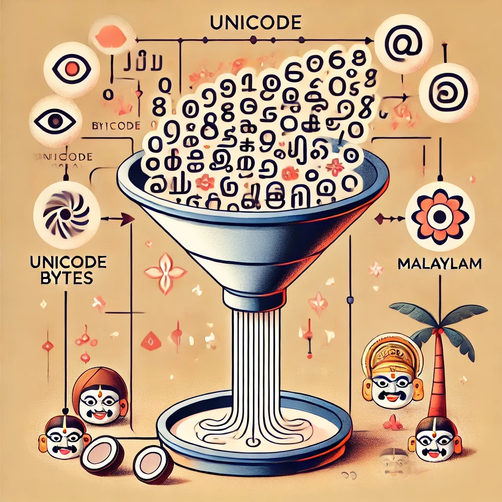

# Building a Malayalam Tokenizer: A Journey into BPE

[Image: A beautiful visualization showing Malayalam script transforming into digital tokens, with a modern tech aesthetic]

## The Challenge
Building a tokenizer for Malayalam, one of India's classical languages, presents unique challenges due to its rich character set and complex script structure. This project explores how to efficiently tokenize Malayalam text using Byte Pair Encoding (BPE).

## Key Insight
The breakthrough came from understanding that each Malayalam character in UTF-8 is represented by 3 bytes. By applying BPE merges strategically, we can:
1. Start with raw bytes (256 tokens)
2. Merge byte pairs to create new tokens
3. Eventually represent each Malayalam character with a single token

## Project Structure
- `simple_bpe.py`: Core BPE implementation with compression analysis
- `04_malayalam_tokenizer_eda.ipynb`: Unicode analysis of Malayalam characters
- `05_create_lvl1_malayalam_merge.ipynb`: Implementation of character-level merges



## The Process
1. **Character Set Analysis**: Mapped all Malayalam Unicode characters (0D00-0D7F)
2. **Byte Pattern Discovery**: Found that Malayalam characters follow consistent UTF-8 patterns
3. **Merge Strategy**: Implemented pair merges to efficiently represent characters

## Results
- Successfully mapped Malayalam characters to unique tokens
- Implemented compression ratio analysis
- Created a foundation for further vocabulary expansion


## Next Steps
- Extend to handle combined characters (സംയുക്താക്ഷരങ്ങൾ)
- Optimize merge rules for common character combinations
- Benchmark against existing tokenizers

## Try It Out
```python
import json
from simple_bpe import tokenize, decode_tokens, encode_text, calculate_compression_ratio

# Load pre-trained merge rules
with open('malayalam_seed_merges.json', 'r') as f:
    merges = json.load(f)

# Test with Malayalam text
text = "മലയാളം"  # Malayalam
raw_tokens = encode_text(text)
compressed_tokens = tokenize(text, merges)

# Calculate compression
ratio = calculate_compression_ratio(raw_tokens, compressed_tokens)
decoded = decode_tokens(compressed_tokens, merges)

print(f"Input text: {text}")
print(f"Number of characters: {len(text)}")  # 6 characters
print(f"Raw tokens: {len(raw_tokens)}")      # 18 bytes
print(f"Compressed tokens: {len(compressed_tokens)}")  # 6 tokens
print(f"Compression ratio: {ratio:.1f}x")    # 3.0x compression
print(f"Successful roundtrip: {text == decoded}")
```

### Sample Output
```
Input text: മലയാളം
Number of characters: 6
Raw tokens: 18 bytes
Compressed tokens: 6
Compression ratio: 3.0x
Space saving: 66.7%
Successful roundtrip: True
```

This demonstrates how we achieve 3x compression while maintaining perfect reconstruction of the original text. Each Malayalam character is effectively represented by a single token instead of three bytes.
